  
  
  

  
  &#8287;&#8287;&#8287;&#8287;&#8287;
  
  &#8287;&#8287;&#8287;&#8287;&#8287;
  
  &#8287;&#8287;&#8287;&#8287;&#8287;

  

----------------
> *"I draw, I code, I occasionally pretend I know what I’m doing."* 😌

## 🧠 About Me
- 🎓 Multimedia Technology student @ **PTIT HCM**  
- 🎨 Artist by heart, Developer by accident  
- 💻 Into design, front-end, digital art, and all things a little weird but beautiful  
- ☕ Currently running on caffeine and half-finished ideas  

## 🛠️ Tech & Tools I Use
> (a.k.a. the stuff that makes my laptop cry)
- **Languages:** JavaScript, Python, C/C++, SQL  
- **Tools & Frameworks:** React, Node.js, Figma, Git, VS Code  
- **Other:** Photoshop, Clip Studio Paint, After Effects  

## 🌈 Current Projects
- 🧩 Building small things that look cool and sometimes even work  
- 🎶 Experimenting with interactive visuals and creative coding  
- 📚 Trying not to break my own portfolio... again  

## 💬 Let's Talk!
- 💌 **Email:** n23dcpt002@student.ptithcm.edu.vn  
- 🌐 **Portfolio :** <a href="https://bkvananh.github.io/">bkvananh.github.io </a>  

## ⚡ Fun Facts
- I can sew plushies, fix laptops, and make them both look cute.  
- I believe every bug hides a story — usually a tragic one.  
- I name my files things like `fghdgfgfsgfdgjfh.js`.  

---

  
  

✨ thanks for scrolling — have a good day and don’t forget to save your file ✨

  

